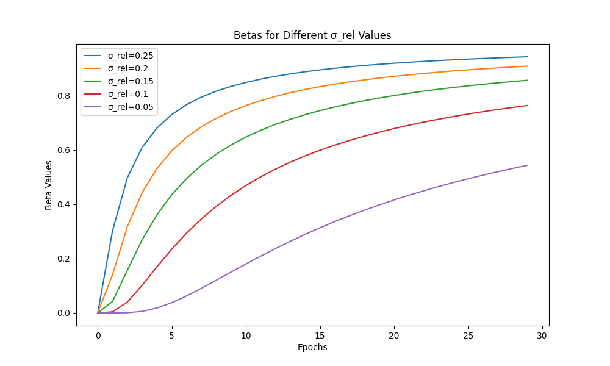

> 📝 Click on the language section to expand / 言語をクリックして展開

# Tools

This document provides documentation for utility tools available in this project. 

## Table of Contents

- [LoRA Post-Hoc EMA merging / LoRAのPost-Hoc EMAマージ](#lora-post-hoc-ema-merging--loraのpost-hoc-emaマージ)
- [Image Captioning with Qwen2.5-VL / Qwen2.5-VLによる画像キャプション生成](#image-captioning-with-qwen25-vl--qwen25-vlによる画像キャプション生成)
- [Static Watermark Mask Detection / 静的ウォーターマークのマスク検出](#static-watermark-mask-detection--静的ウォーターマークのマスク検出)

## LoRA Post-Hoc EMA merging / LoRAのPost-Hoc EMAマージ

The LoRA Post-Hoc EMA (Exponential Moving Average) merging is a technique to combine multiple LoRA checkpoint files into a single, potentially more stable model. This method applies exponential moving average across multiple checkpoints sorted by modification time, with configurable decay rates.

The Post-Hoc EMA method works by:

1. Sorting checkpoint files by modification time (oldest to newest)
2. Using the oldest checkpoint as the base
3. Iteratively merging subsequent checkpoints with a decay rate (beta)
4. Optionally using linear interpolation between two beta values across the merge process

Pseudo-code for merging multiple checkpoints with beta=0.95 would look like this:

```
beta = 0.95
checkpoints = [checkpoint1, checkpoint2, checkpoint3]  # List of checkpoints
merged_weights = checkpoints[0]  # Use the first checkpoint as the base
for checkpoint in checkpoints[1:]:
    merged_weights = beta * merged_weights + (1 - beta) * checkpoint
```

### Key features:

- **Temporal ordering**: Automatically sorts files by modification time
- **Configurable decay rates**: Supports single beta value or linear interpolation between two beta values
- **Metadata preservation**: Maintains and updates metadata from the last checkpoint
- **Hash updating**: Recalculates model hashes for the merged weights
- **Dtype preservation**: Maintains original data types of tensors

### Usage

The LoRA Post-Hoc EMA merging is available as a standalone script:

```bash
python src/musubi_tuner/lora_post_hoc_ema.py checkpoint1.safetensors checkpoint2.safetensors checkpoint3.safetensors --output_file merged_lora.safetensors --beta 0.95
```

### Command line options:

```
path [path ...]
    List of paths to the LoRA weight files to merge

--beta BETA
    Decay rate for merging weights (default: 0.95)
    Higher values (closer to 1.0) give more weight to the accumulated average
    Lower values give more weight to the current checkpoint

--beta2 BETA2
    Second decay rate for linear interpolation (optional)
    If specified, the decay rate will linearly interpolate from beta to beta2
    across the merging process

--sigma_rel SIGMA_REL
    Relative sigma for Power Function EMA (optional, mutually exclusive with beta/beta2)
    This resolves the issue where the first checkpoint has a disproportionately large influence when beta is specified.
    If specified, beta is calculated using the Power Function EMA method from the paper:
    https://arxiv.org/pdf/2312.02696. This overrides beta and beta2.

--output_file OUTPUT_FILE
    Output file path for the merged weights (required)

--no_sort
    Disable sorting of checkpoint files (merge in specified order)
```

### Examples:

Basic usage with constant decay rate:
```bash
python src/musubi_tuner/lora_post_hoc_ema.py \
    lora_epoch_001.safetensors \
    lora_epoch_002.safetensors \
    lora_epoch_003.safetensors \
    --output_file lora_ema_merged.safetensors \
    --beta 0.95
```

Using linear interpolation between two decay rates:
```bash
python src/musubi_tuner/lora_post_hoc_ema.py \
    lora_epoch_001.safetensors \
    lora_epoch_002.safetensors \
    lora_epoch_003.safetensors \
    --output_file lora_ema_interpolated.safetensors \
    --beta 0.90 \
    --beta2 0.95
```

Using Power Function EMA with `sigma_rel`:
```bash
python src/musubi_tuner/lora_post_hoc_ema.py \
    lora_epoch_001.safetensors \
    lora_epoch_002.safetensors \
    lora_epoch_003.safetensors \
    --output_file lora_power_ema_merged.safetensors \
    --sigma_rel 0.2
```


#### betas for different σ-rel values:



### Recommended settings example (after training for 30 epochs, using  `--beta`)

If you're unsure which settings to try, start with the following "General Recommended Settings".

#### 1. General Recommended Settings (start with these combinations)

- **Target Epochs:** `15-30` (the latter half of training)
- **beta:** `0.9` (a balanced value)

#### 2. If training converged early

- **Situation:** Loss dropped early and stabilized afterwards.
- **Target Epochs:** `10-30` (from the epoch where loss stabilized to the end)
- **beta:** `0.95` (wider range, smoother)

#### 3. If you want to avoid overfitting

- **Situation:** In the latter part of training, generated results are too similar to training data.
- **Target Epochs:** `15-25` (focus on the peak performance range)
- **beta:** `0.8` (more emphasis on the latter part of the range while maintaining diversity)

**Note:** The optimal values may vary depending on the model and dataset. It's recommended to experiment with multiple `beta` values (e.g., 0.8, 0.9, 0.95) and compare the generated results.

### Recommended Settings Example (30 epochs training, using `--sigma_rel`)

When using `--sigma_rel`, the beta decay schedule is determined by the Power Function EMA method. Here are some starting points:

#### 1. General Recommended Settings
- **Target Epochs:** All epochs (from the first to the last).
- **sigma_rel:** `0.2` (a general starting point).

#### 2. If training converged early
- **Situation:** Loss dropped early and stabilized afterwards.
- **Target Epochs:** All epochs.
- **sigma_rel:** `0.25` (gives more weight to earlier checkpoints, suitable for early convergence).

#### 3. If you want to avoid overfitting
- **Situation:** In the latter part of training, generated results are too similar to training data.
- **Target Epochs:** From the first epoch, omitting the last few potentially overfitted epochs.
- **sigma_rel:** `0.15` (gives more weight to later (but not the very last) checkpoints, helping to mitigate overfitting from the final stages).

**Note:** The optimal `sigma_rel` value can depend on the dataset, model, and training duration. Experimentation is encouraged. Values typically range from 0.1 to 0.5. A graph showing the relationship between `sigma_rel` and the calculated `beta` values over epochs will be provided later to help understand its behavior.

### Notes:

- Files are automatically sorted by modification time, so the order in the command line doesn't matter
- The `--sigma_rel` option is mutually exclusive with `--beta` and `--beta2`. If `--sigma_rel` is provided, it will determine the beta values, and any provided `--beta` or `--beta2` will be ignored.
- All checkpoint files to be merged should be from the same training run, saved per epoch or step
    - Merging is possible if shapes match, but may not work correctly as Post Hoc EMA
- All checkpoint files must have the same alpha value
- The merged model will have updated hash values in its metadata 
- The metadata of the merged model will be taken from the last checkpoint, with only the hash value recalculated
- Non-float tensors (long, int, bool, etc.) are not merged and will use the first checkpoint's values
- Processing is done in float32 precision to maintain numerical stability during merging. The original data types are preserved when saving

<details>
<summary>日本語</summary>

LoRA Post-Hoc EMA（指数移動平均）マージは、複数のLoRAチェックポイントファイルを単一の、より安定したモデルに結合する手法です。スクリプトでは、修正時刻でソート（古い順）された複数のチェックポイントに対して指定された減衰率で指数移動平均を適用します。減衰率は指定可能です。

Post-Hoc EMA方法の動作：

1. チェックポイントファイルを修正時刻順（古いものから新しいものへ）にソート
2. 最古のチェックポイントをベースとして使用
3. 減衰率（beta）を使って後続のチェックポイントを反復的にマージ
4. オプションで、マージプロセス全体で2つのベータ値間の線形補間を使用

疑似コードによるイメージ：複数のチェックポイントをbeta=0.95でマージする場合、次のように計算されます。

```
beta = 0.95
checkpoints = [checkpoint1, checkpoint2, checkpoint3]  # チェックポイントのリスト
merged_weights = checkpoints[0]  # 最初のチェックポイントをベースとして使用
for checkpoint in checkpoints[1:]:
    merged_weights = beta * merged_weights + (1 - beta) * checkpoint
```

### 主な特徴：

- **時系列順序付け**: ファイルを修正時刻で自動的にソート
- **設定可能な減衰率**: 単一のベータ値または2つのベータ値間の線形補間をサポート
- **メタデータ保持**: 最後のチェックポイントからメタデータを維持・更新
- **ハッシュ更新**: マージされた重みのモデルハッシュを再計算
- **データ型保持**: テンソルの元のデータ型を維持

### 使用法

LoRA Post-Hoc EMAマージは独立したスクリプトとして提供されています：

```bash
python src/musubi_tuner/lora_post_hoc_ema.py checkpoint1.safetensors checkpoint2.safetensors checkpoint3.safetensors --output_file merged_lora.safetensors --beta 0.95
```

### コマンドラインオプション：

```
path [path ...]
    マージするLoRA重みファイルのパスのリスト

--beta BETA
    重みマージのための減衰率（デフォルト：0.95）
    高い値（1.0に近い）は累積平均により大きな重みを与える（古いチェックポイントを重視）
    低い値は現在のチェックポイントにより大きな重みを与える

--beta2 BETA2
    線形補間のための第2減衰率（オプション）
    指定された場合、減衰率はマージプロセス全体でbetaからbeta2へ線形補間される

--sigma_rel SIGMA_REL
    Power Function EMAのための相対シグマ（オプション、beta/beta2と同時に指定できません）
    betaを指定した場合の、最初のチェックポイントが相対的に大きな影響を持つ欠点を解決します
    指定された場合、betaは次の論文に基づいてPower Function EMA法で計算されます：
    https://arxiv.org/pdf/2312.02696. これによりbetaとbeta2が上書きされます。

--output_file OUTPUT_FILE
    マージされた重みの出力ファイルパス（必須）

--no_sort
    チェックポイントファイルのソートを無効にする（指定した順序でマージ）
```

### 例：

定数減衰率での基本的な使用法：
```bash
python src/musubi_tuner/lora_post_hoc_ema.py \
    lora_epoch_001.safetensors \
    lora_epoch_002.safetensors \
    lora_epoch_003.safetensors \
    --output_file lora_ema_merged.safetensors \
    --beta 0.95
```

2つの減衰率間の線形補間を使用：
```bash
python src/musubi_tuner/lora_post_hoc_ema.py \
    lora_epoch_001.safetensors \
    lora_epoch_002.safetensors \
    lora_epoch_003.safetensors \
    --output_file lora_ema_interpolated.safetensors \
    --beta 0.90 \
    --beta2 0.95
```

`シグマ_rel`を使用したPower Function EMA：
```bash
python src/musubi_tuner/lora_post_hoc_ema.py \
    lora_epoch_001.safetensors \
    lora_epoch_002.safetensors \
    lora_epoch_003.safetensors \
    --output_file lora_power_ema_merged.safetensors \
    --sigma_rel 0.2
```

### 推奨設定の例 (30エポック学習し、 `--beta`を使用する場合)

どの設定から試せば良いか分からない場合は、まず以下の「**一般的な推奨設定**」から始めてみてください。

#### 1. 一般的な推奨設定 (まず試すべき組み合わせ)

- **対象エポック:** `15-30` (学習の後半半分)
- **beta:** `0.9` (バランスの取れた値)

#### 2. 早期に学習が収束した場合

- **状況:** lossが早い段階で下がり、その後は安定している。
- **対象エポック:** `10-30` (lossが安定し始めたエポックから最後まで)
- **beta:** `0.95` (対象範囲が広いので、より滑らかにする)

#### 3. 過学習を避けたい場合

- **状況:** 学習の最後の方で、生成結果が学習データに似すぎている。
- **対象エポック:** `15-25` (性能のピークと思われる範囲に絞る)
- **beta:** `0.8` (範囲の終盤を重視しつつ、多様性を残す)

**ヒント:** 最適な値はモデルやデータセットによって異なります。複数の`beta`（例: 0.8, 0.9, 0.95）を試して、生成結果を比較することをお勧めします。

### 推奨設定の例 (30エポック学習し、 `--sigma_rel`を使用する場合)

`--sigma_rel` を使用する場合、betaの減衰スケジュールはPower Function EMA法によって決定されます。以下はいくつかの開始点です。

#### 1. 一般的な推奨設定
- **対象エポック:** 全てのエポック（最初から最後まで）
- **sigma_rel:** `0.2` （一般的な開始点）

#### 2. 早期に学習が収束した場合
- **状況:** lossが早い段階で下がり、その後は安定している。
- **対象エポック:** 全てのエポック
- **sigma_rel:** `0.25` （初期のチェックポイントに重きを置くため、早期収束に適しています）

#### 3. 過学習を避けたい場合
- **状況:** 学習の最後の方で、生成結果が学習データに似すぎている。
- **対象エポック:** 最初のエポックから、過学習の可能性がある最後の数エポックを除外
- **sigma_rel:** `0.15` （終盤（ただし最後の最後ではない）のチェックポイントに重きを置き、最終段階での過学習を軽減するのに役立ちます）

**ヒント:** 最適な `sigma_rel` の値は、データセット、モデル、学習期間によって異なる場合があります。実験を推奨します。値は通常0.1から0.5の範囲です。`sigma_rel` とエポックごとの計算された `beta` 値の関係を示すグラフは、その挙動を理解するのに役立つよう後ほど提供する予定です。

### 注意点：

- ファイルは修正時刻で自動的にソートされるため、コマンドラインでの順序は関係ありません
- `--sigma_rel`オプションは`--beta`および`--beta2`と相互に排他的です。`--sigma_rel`が指定された場合、それがベータ値を決定し、指定された`--beta`または`--beta2`は無視されます。
- マージする全てのチェックポイントファイルは、ひとつの学習で、エポックごと、またはステップごとに保存されたモデルである必要があります
    - 形状が一致していればマージはできますが、Post Hoc EMAとしては正しく動作しません
- alpha値はすべてのチェックポイントで同じである必要があります
- マージされたモデルのメタデータは、最後のチェックポイントのものが利用されます。ハッシュ値のみが再計算されます
- 浮動小数点以外の、long、int、boolなどのテンソルはマージされません（最初のチェックポイントのものが使用されます）
- マージ中の数値安定性を維持するためにfloat32精度で計算されます。保存時は元のデータ型が維持されます

</details>

## Image Captioning with Qwen2.5-VL / Qwen2.5-VLによる画像キャプション生成

The `caption_images_by_qwen_vl.py` script automatically generates captions for a directory of images using a fine-tuned Qwen2.5-VL model. It's designed to help prepare datasets for training by creating captions from the images themselves.

The Qwen2.5-VL model used in Qwen-Image is not confirmed to be the same as the original Qwen2.5-VL-Instruct model, but it appears to work for caption generation based on the tests conducted.

<details>
<summary>日本語</summary>

`caption_images_by_qwen_vl.py`スクリプトは、Qwen2.5-VLモデルを使用して、指定されたディレクトリ内の画像に対するキャプションを自動生成します。画像自体からキャプションを作成することで、学習用データセットの準備を支援することを目的としています。

Qwen-Imageで使用されているQwen2.5-VLモデルは、元のQwen2.5-VL-Instructモデルと同じかどうか不明ですが、試した範囲ではキャプション生成も動作するようです。

</details>

### Arguments

-   `--image_dir` (required): Path to the directory containing the images to be captioned.
-   `--model_path` (required): Path to the Qwen2.5-VL model. See [here](./qwen_image.md#download-the-model--モデルのダウンロード) for instructions.
-   `--output_file` (optional): Path to the output JSONL file. This is required if `--output_format` is `jsonl`.
-   `--max_new_tokens` (optional, default: 1024): The maximum number of new tokens to generate for each caption.
-   `--prompt` (optional, default: see script): A custom prompt to use for caption generation. You can use `\n` for newlines.
-   `--max_size` (optional, default: 1280): The maximum size of the image. Images are resized to fit within a `max_size` x `max_size` area while maintaining aspect ratio.
-   `--fp8_vl` (optional, flag): If specified, the Qwen2.5-VL model is loaded in fp8 precision for lower memory usage.
-   `--output_format` (optional, default: `jsonl`): The output format. Can be `jsonl` to save all captions in a single JSONL file, or `text` to save a separate `.txt` file for each image.

`--max_size` can be reduced to decrease the image size passed to the VLM. This can reduce the memory usage of the VLM, but may also decrease the quality of the generated captions.

The default prompt is defined in the [source file](/src/musubi_tuner/caption_images_by_qwen_vl.py). It is based on the [Qwen-Image Technical Report](https://arxiv.org/abs/2508.02324).

<details>
<summary>日本語</summary>

-   `--image_dir` (必須): キャプションを生成する画像が含まれるディレクトリへのパス。
-   `--model_path` (必須): Qwen2.5-VLモデルへのパス。詳細は[こちら](./qwen_image.md#download-the-model--モデルのダウンロード)を参照してください。
-   `--output_file` (任意): 出力先のJSONLファイルへのパス。`--output_format`が`jsonl`の場合に必須です。
-   `--max_new_tokens` (任意, デフォルト: 1024): 各キャプションで生成する新しいトークンの最大数。
-   `--prompt` (任意, デフォルト: スクリプト内参照): キャプション生成に使用するカスタムプロンプト。`\n`で改行を指定できます。
-   `--max_size` (任意, デフォルト: 1280): 画像の最大サイズ。アスペクト比を維持したまま、画像の合計ピクセル数が`max_size` x `max_size`の領域に収まるようにリサイズされます。
-   `--fp8_vl` (任意, フラグ): 指定された場合、Qwen2.5-VLモデルがfp8精度で読み込まれ、メモリ使用量が削減されます。
-   `--output_format` (任意, デフォルト: `jsonl`): 出力形式。`jsonl`を指定するとすべてのキャプションが単一のJSONLファイルに保存され、`text`を指定すると画像ごとに個別の`.txt`ファイルが保存されます。

`--max_size` を小さくするとVLMに渡される画像サイズが小さくなります。これにより、VLMのメモリ使用量が削減されますが、生成されるキャプションの品質が低下する可能性があります。

プロンプトのデフォルトは、[ソースファイル](/src/musubi_tuner/caption_images_by_qwen_vl.py)内で定義されています。[Qwen-Image Technical Report](https://arxiv.org/abs/2508.02324)を参考にしたものです。

</details>

### Usage Examples

**1. Basic Usage (JSONL Output)**

```bash
python src/musubi_tuner/caption_images_by_qwen_vl.py \
  --image_dir /path/to/images \
  --model_path /path/to/qwen_model.safetensors \
  --output_file /path/to/captions.jsonl
```

**2. Text File Output**

This will create a `.txt` file with the same name as each image in the `/path/to/images` directory.

```bash
python src/musubi_tuner/caption_images_by_qwen_vl.py \
  --image_dir /path/to/images \
  --model_path /path/to/qwen_model.safetensors \
  --output_format text
```

**3. Advanced Usage (fp8, Custom Prompt, and Max Size)**

```bash
python src/musubi_tuner/caption_images_by_qwen_vl.py \
  --image_dir /path/to/images \
  --model_path /path/to/qwen_model.safetensors \
  --output_file /path/to/captions.jsonl \
  --fp8_vl \
  --max_size 1024 \
  --prompt "A detailed and descriptive caption for this image is:\n"
```

## Static Watermark Mask Detection / 静的ウォーターマークのマスク検出

`detect_watermark_mask.py` scans a directory of videos for a burned-in static watermark and writes a per-video loss mask next to each file. During training the masked region is excluded from the loss, so the model does not learn the watermark while the frame is still trained at full size.

Detection compares frames sampled evenly across the video: a static watermark has a near-zero temporal standard deviation, while the content underneath it changes. Semi-transparent watermarks keep varying with the content and are invisible to that test, so a second pass looks at the temporal median of the image gradient, where the content cancels out and the watermark does not. Only `opencv-python` and `numpy` are required.

### Usage

```bash
python src/musubi_tuner/detect_watermark_mask.py --video_dir /path/to/video_dir --corner_only
```

This writes `{video_stem}_wmask.png` (white = train, black = ignore) next to each video, which the dataset picks up automatically. The watermark does not have to be on screen the whole time — up to `--frame_tolerance` of the sampled frames (10% by default) may be without it. Only *moving* watermarks are unsupported, since a single mask cannot describe them; those clips should be dropped from the dataset.

See the [static watermark masking documentation](./watermark_mask.md) for the full option list, the dataset configuration, and how the mask is applied to the loss.

<details>
<summary>日本語</summary>

`detect_watermark_mask.py` は、ディレクトリ内の動画から焼き込まれた静的なウォーターマークを検出し、各動画の隣に損失用のマスクを書き出します。学習時にはマスクされた領域が損失から除外されるため、フレームはフルサイズで学習しつつ、モデルがウォーターマークを学習することを防げます。

検出は、動画から均等にサンプリングしたフレームを比較して行います。静的なウォーターマークは時間方向の標準偏差がほぼゼロですが、その下のコンテンツは変化します。半透明のウォーターマークはコンテンツに応じて変化し続けるためこの方法では検出できないので、2つ目のパスとして画像の勾配の時間方向の中央値を見ます。コンテンツの勾配は相殺されますが、ウォーターマークの勾配は残ります。必要なのは `opencv-python` と `numpy` だけです。

上記のコマンドで、各動画の隣に `{動画名}_wmask.png`（白＝学習する、黒＝無視する）が書き出され、データセットが自動的に読み込みます。ウォーターマークは常に画面に表示されている必要はありません。サンプリングされたフレームのうち `--frame_tolerance` の割合（デフォルトは10%）までは、表示されていなくても構いません。単一のマスクで表現できない**移動する**ウォーターマークのみが非対応です。そのようなクリップはデータセットから除外してください。

オプションの一覧、データセットの設定、損失への適用方法については、[静的ウォーターマークのマスクのドキュメント](./watermark_mask.md)を参照してください。
</details>
